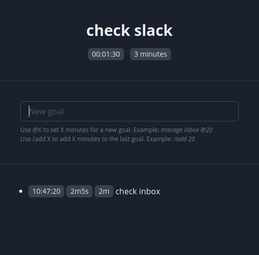

# xoal

Yet another cross-platform goal tracker. Just for fun.

* Xoal doesn't allow to have several tasks at the same time.
* Xoal requires you to assign a deadline for a goal.
* Xoal notifies you when you run out of time for a goal.
* Xoal has only one input — your next task. Current task is displayed on top of this input.

Other task trackers are great, but I want an annoying goal tracker that will notify me when I do
something for too long time. Because sometimes I just forget to set a new goal and get distracted by
completely different task. Xoal helps to stay on the same goal or at least observe the fact that
I've got distracted.



# Tech

* React
* Node
* Electron
* TypeScript
* Chakra UI

# Dev: start

```
nvm install lts/gallium
npm run dev:react
```

```
npm run dev:electron
```

# Build a release

```
npx electron-builder
```

# License

MIT

